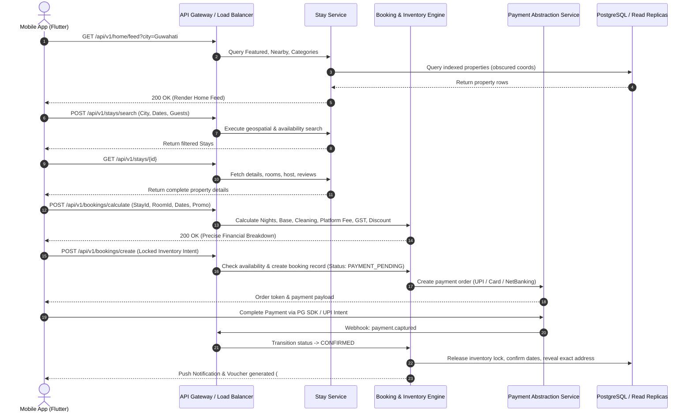
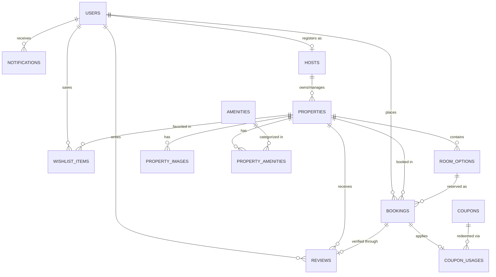
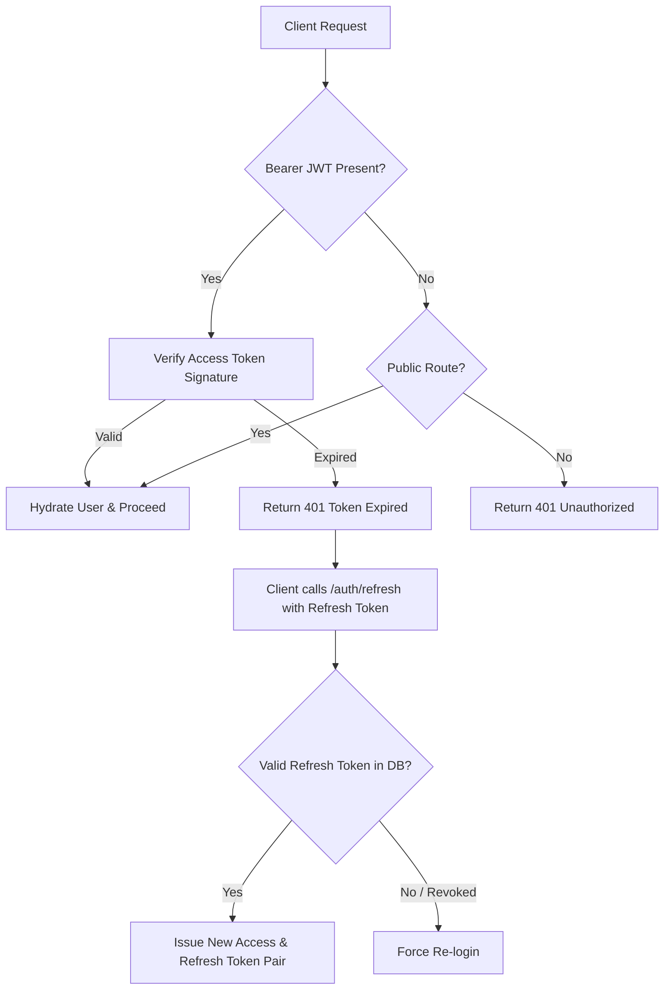
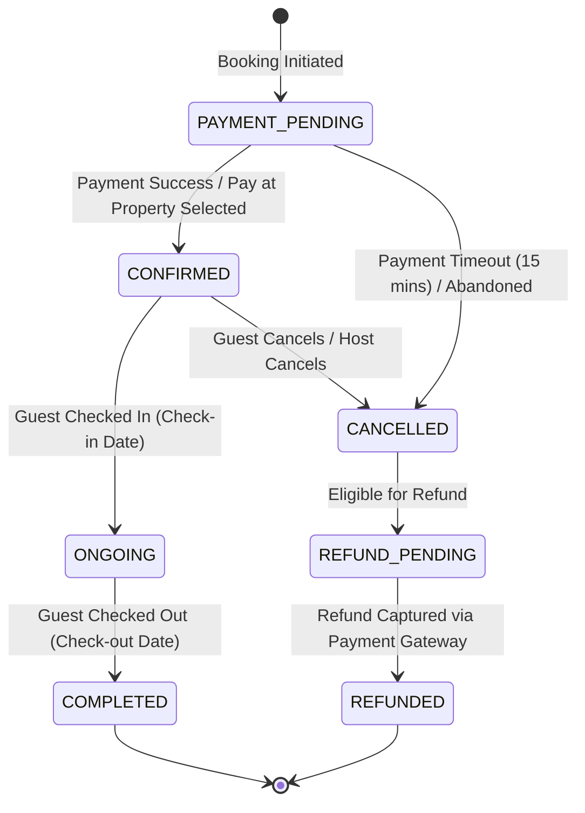

# BACKEND IMPLEMENTATION SPECIFICATION & BLUEPRINT
## SewaSetu: Multi-Service Marketplace Platform (Primary Focus: Stay / Accommodation)

> **Document Status**: Production Blueprint  
> **Target Audience**: Backend Developers, API Engineers, Database Architects, System Administrators  
> **Source Base**: Analysis of the complete Flutter Frontend Codebase (`lib/`)  
> **Specification Version**: 1.0.0  
> **Compliance Legend**:
> - `[CONFIRMED FROM FRONTEND]`: Directly mapped from existing models, controllers, screens, and enums in Flutter.
> - `[RECOMMENDED FOR BACKEND]`: Industry-standard architectural requirement necessary to make the frontend functional, scalable, and secure.
> - `[FUTURE REQUIREMENT]`: Architecture designed to support secondary marketplace modules (Services, Rentals, Trips) and Multi-Vendor/Admin extensions.

---

## TABLE OF CONTENTS
1. [Project Overview & Core Domain Architecture](#1-project-overview--core-domain-architecture)
2. [Complete Module Analysis](#2-complete-module-analysis)
3. [Feature Analysis & Screen Inventory](#3-feature-analysis--screen-inventory)
4. [End-to-End User Journeys & State Machines](#4-end-to-end-user-journeys--state-machines)
5. [Role-Based Access Control (RBAC) Matrix](#5-role-based-access-control-rbac-matrix)
6. [Database Architecture & Strategy](#6-database-architecture--strategy)
7. [Complete Database Model Specifications (Data Dictionary)](#7-complete-database-model-specifications-data-dictionary)
8. [Database Entity Relationship Diagrams & Foreign Keys](#8-database-entity-relationship-diagrams--foreign-keys)
9. [API Architecture & Conventions](#9-api-architecture--conventions)
10. [Complete REST API Endpoint Documentation](#10-complete-rest-api-endpoint-documentation)
11. [Request & Response Payloads (JSON Specifications)](#11-request--response-payloads-json-specifications)
12. [Comprehensive Validation Rules & Sanitization](#12-comprehensive-validation-rules--sanitization)
13. [Authentication Architecture (JWT, Sessions & Phone OTP)](#13-authentication-architecture-jwt-sessions--phone-otp)
14. [Authorization Architecture & Middleware Pipeline](#14-authorization-architecture--middleware-pipeline)
15. [Stay Module Deep Backend Specification](#15-stay-module-deep-backend-specification)
16. [Search, Geographic Proximity & Dynamic Filter Logic](#16-search-geographic-proximity--dynamic-filter-logic)
17. [Property Inventory & Date-Based Availability Engine](#17-property-inventory--date-based-availability-engine)
18. [Booking Lifecycle & State Machine Engine](#18-booking-lifecycle--state-machine-engine)
19. [Payment Architecture, Settlement & Webhooks](#19-payment-architecture-settlement--webhooks)
20. [Wishlist & Collection Management Logic](#20-wishlist--collection-management-logic)
21. [Review, Rating & Verification Engine](#21-review-rating--verification-engine)
22. [Notification System & Delivery Pipeline](#22-notification-system--delivery-pipeline)
23. [Vendor / Host Management Portal Requirements](#23-vendor--host-management-portal-requirements)
24. [Platform Admin & Backoffice Management](#24-platform-admin--backoffice-management)
25. [Super Admin & Platform Governance](#25-super-admin--platform-governance)
26. [File Upload, Asset Processing & CDN Architecture](#26-file-upload-asset-processing--cdn-architecture)
27. [Security Requirements & Threat Mitigation](#27-security-requirements--threat-mitigation)
28. [Standardized Error Handling Strategy](#28-standardized-error-handling-strategy)
29. [Recommended Backend Folder Architecture](#29-recommended-backend-folder-architecture)
30. [Backend Implementation Roadmap (Phased Plan)](#30-backend-implementation-roadmap-phased-plan)
31. [Missing Requirements, Gaps & Clarification Questions](#31-missing-requirements-gaps--clarification-questions)

---

## 1. PROJECT OVERVIEW & CORE DOMAIN ARCHITECTURE

### 1.1 Business Summary
SewaSetu is a high-performance, mobile-first marketplace platform designed for India, with primary operations starting in Northeast India (Guwahati, Shillong) and expanding pan-India (Goa, Manali, Jaipur, Bengaluru, Delhi NCR).

The **PRIMARY & CORE BUSINESS** is **Stay / Accommodation**, comprising:
1. **Rooms**: Private, single/double independent rooms with monthly or daily rental arrangements.
2. **PG (Paying Guest) / Hostels**: Student and working professional accommodations bundled with amenities (meals, Wi-Fi, laundry).
3. **Mess / Food**: Daily meal subscriptions and fooding accommodations.
4. **Homestays**: Experiential local villas, hillside cottages, and family-hosted properties.
5. **Hotels & Resorts**: Short-term luxury, boutique, and commercial accommodations.

Secondary on-demand modules designed into the platform architecture include:
- **Local Home Services**: Electrician, Plumber, Driver, Cleaning.
- **Vehicle Rentals**: Self-drive cars and motorbikes.
- **Curated Travel Packages**: Destination tours (Meghalaya, Himachal Pradesh, Goa).

### 1.2 Core Architectural Principles Derived from Frontend
1. **Module Independence**: The Stay module can scale in complexity without breaking or tangling with secondary modules.
2. **Location Privacy Rule (Strict)**: `[CONFIRMED FROM FRONTEND]` As enforced in `AppInteractiveMapCanvas` and `LocationMapPreviewWidget`, exact street addresses and exact GPS coordinates are **never disclosed publicly** during browsing or searching. The public API must obfuscate coordinates within a **~400-meter randomized circular boundary**. Exact coordinates and street-level directions are released **only upon confirmed and paid booking**.
3. **Dual Pricing Model**: Properties support both `pricePerNight` (daily rate) and optional `pricePerMonth` (long-term rate for students/PGs).
4. **Standardized Response Envelope**: All endpoints communicate via an envelope: `{ "success": boolean, "message": string, "data": T, "error": string? }` as codified in `ApiResponse<T>` (`lib/core/network/api_response.dart`).

---

## 2. COMPLETE MODULE ANALYSIS

### 2.1 AUTH MODULE (`lib/modules/auth/`)
- **Purpose**: Identity verification, user session establishment, credential recovery, and onboarding consent.
- **Frontend Entities**: `UserModel` (`lib/modules/auth/models/user_model.dart`).
- **Screens**:
  1. `LoginScreen` (`login_screen.dart`): Mobile phone number input (with `+91` pre-fill), password input, remember me, fast OTP redirection, and guest skip.
  2. `SignUpScreen` (`signup_screen.dart`): Full Name, Phone (10 digits), Email (optional), Password (>= 6 chars), and Terms & Conditions consent toggle.
  3. `OtpVerificationScreen` (`otp_verification_screen.dart`): 6 individual auto-advancing digit fields, 30-second resend countdown timer, and verify submission.
  4. `ForgotPasswordScreen` (`forgot_password_screen.dart`): Phone/Email submission for OTP/link password recovery.
- **User Actions**:
  - Request login OTP / login with password
  - Register new account with validation
  - Verify 6-digit OTP
  - Resend OTP (with 30-second cooldown throttle)
  - Request password reset token
  - Skip authentication (guest browsing)
- **Required Backend APIs**:
  - `POST /api/v1/auth/register`
  - `POST /api/v1/auth/login-phone`
  - `POST /api/v1/auth/login-password`
  - `POST /api/v1/auth/send-otp`
  - `POST /api/v1/auth/verify-otp`
  - `POST /api/v1/auth/resend-otp`
  - `POST /api/v1/auth/forgot-password`
  - `POST /api/v1/auth/reset-password`
  - `POST /api/v1/auth/refresh`
  - `POST /api/v1/auth/logout`
- **Required Database Models**: `User`, `UserCredential`, `OtpVerification`, `SessionRefreshToken`, `AuditLog`.

---

### 2.2 HOME MODULE (`lib/modules/home/`)
- **Purpose**: Aggregation hub for discovery, geolocation switching, search triggers, categories, curated accommodations, and secondary service banners.
- **Frontend Entities**: `PropertyModel`, `LocationService`.
- **Screens**:
  1. `MainNavigationShell` (`main_navigation_shell.dart`): Persistent bottom navigation bar controlling 5 tabs (Home, Stays, Bookings, Wishlist, Profile).
  2. `HomeScreen` (`home_screen.dart`): Top header with city selector, search pill, category bar, featured stays carousel, nearby stays list, recommended stays, top destinations, recently viewed, and secondary services.
- **User Actions**:
  - Switch current city / request GPS location detection (`LocationSelectorModal`)
  - Tap floating search bar -> navigates to multi-step search
  - Select Stay Category (Room, PG, Mess, Homestay, Hotel) -> navigates to filtered listings
  - Browse horizontal carousels (Featured Stays, Recommended Stays, Popular Destinations)
  - Toggle accommodation favorite button
  - Navigate to secondary services (Local Services, Rentals, Trips)
  - Tap Notification bell -> navigates to Notification Center
- **Required Backend APIs**:
  - `GET /api/v1/home/feed?city={city}` (Aggregated home feed)
  - `GET /api/v1/locations/cities` (Supported operating cities)
  - `GET /api/v1/locations/reverse-geocode?lat={lat}&lng={lng}` (GPS coordinate to city)
- **Required Database Models**: `Property`, `City`, `Destination`, `CategoryConfig`.

---

### 2.3 STAY MODULE (`lib/modules/stay/`) — PRIMARY CORE MODULE
- **Purpose**: End-to-end accommodation discovery, spatial map rendering, multi-parameter filtering, property details, room options selection, host profiling, and reviews.
- **Frontend Entities**: `PropertyModel`, `StayHostEntity`, `RoomOptionItem`, `AmenityModel`, `ReviewModel`, `StayFilterCriteria`.
- **Screens**:
  1. `StayScreen` (`stay_screen.dart`): Category selector bar, sorting sheet trigger, advanced filter sheet trigger, view mode toggle (List, Grid, Map), property feed.
  2. `SearchScreen` (`search_screen.dart`): Multi-step search overlay: Step 1 (City/Area search + recent searches), Step 2 (Check-in/Check-out calendar date range + flexibility), Step 3 (Guest counters: Adults, Children, Rooms).
  3. `PropertyDetailsScreen` (`property_details_screen.dart`): Hero image carousel with full-screen gallery trigger, title, rating, verified badge, 400m privacy location card preview, room options selector, amenities grid modal, host card, verified review cards modal, similar properties carousel, and sticky bottom booking CTA bar.
  4. `FullScreenGalleryScreen` (`full_screen_gallery_screen.dart`): Pinch-to-zoom interactive viewer (`InteractiveViewer`) and pagination index counter.
- **User Actions**:
  - Query properties with fuzzy keyword search
  - Filter by `stay_type`, price range (`min_price`, `max_price`), rating (`min_rating`), amenities array, and `verified_only`
  - Sort properties by `recommended`, `price_low_to_high`, `price_high_to_low`, `rating_high_to_low`
  - Switch view mode between List, 2-Column Grid, and Interactive Map canvas
  - View simulated 400m privacy location marker on map
  - Select specific Room Option item (`RoomOptionItem`)
  - View host response rate, join date, and SuperHost status
  - Open and paginate guest reviews
  - View similar properties in the same locality
- **Required Backend APIs**:
  - `GET /api/v1/stays`
  - `GET /api/v1/stays/{id}`
  - `GET /api/v1/stays/featured`
  - `GET /api/v1/stays/nearby`
  - `GET /api/v1/stays/search`
  - `GET /api/v1/stays/categories`
  - `GET /api/v1/stays/amenities`
  - `GET /api/v1/stays/{id}/rooms`
  - `GET /api/v1/stays/{id}/reviews`
  - `POST /api/v1/stays/{id}/reviews`
  - `GET /api/v1/stays/{id}/availability`
  - `GET /api/v1/stays/{id}/similar`
- **Required Database Models**: `Property`, `RoomOption`, `Amenity`, `PropertyAmenity`, `Host`, `Review`, `PropertyImage`, `SearchHistory`.

---

### 2.4 BOOKINGS MODULE (`lib/modules/bookings/`)
- **Purpose**: Reservation checkout, price and tax computations, promo code discounting, payment gateway integration, voucher generation, and booking lifecycle state tracking.
- **Frontend Entities**: `BookingModel`, `PaymentMethodType`, `BookingStatus`.
- **Screens**:
  1. `BookingCheckoutScreen` (`booking_checkout_screen.dart`): Reservation summary card, check-in/out date verification, guest counter stepper, pricing breakdown (base rate, nights count, cleaning fee, platform service fee, 12% GST calculation), promo coupon field (`WELCOME500`), payment method radio selector (UPI, Card, NetBanking, Pay at Property), and Confirm & Pay action.
  2. `BookingConfirmationScreen` (`booking_confirmation_screen.dart`): Celebratory voucher screen with booking reference code (`#SS-XXXXX`), payment status badge, reservation dates, and action navigation.
  3. `BookingDetailsScreen` (`booking_details_screen.dart`): Full voucher view, host contact details (`hostName`, `hostPhone`), property location, breakdown table, and action buttons: Download PDF Invoice and Cancel Booking (with dialog modal).
  4. `BookingsScreen` (`bookings_screen.dart`): Tabbed reservation screen: Upcoming, Completed, and Cancelled.
- **User Actions**:
  - Initiate booking from property details
  - Adjust guest counts at checkout
  - Apply and validate promotional coupon codes
  - Select payment method
  - Confirm booking and trigger payment
  - View live booking voucher and download invoice
  - Cancel reservation with automated refund rules
  - Contact host via phone
- **Required Backend APIs**:
  - `POST /api/v1/bookings/calculate` (Pre-checkout price computation)
  - `POST /api/v1/bookings/create` (Initiate booking lock)
  - `GET /api/v1/bookings` (User bookings list with status filters)
  - `GET /api/v1/bookings/{id}` (Booking details & voucher)
  - `POST /api/v1/bookings/{id}/cancel` (Cancellation & refund initiation)
  - `GET /api/v1/bookings/{id}/invoice` (PDF invoice stream/download)
  - `POST /api/v1/coupons/validate` (Coupon code verification)
- **Required Database Models**: `Booking`, `BookingItem`, `PaymentTransaction`, `Coupon`, `CouponUsage`, `CancellationRecord`.

---

### 2.5 WISHLIST MODULE (`lib/modules/wishlist/`)
- **Purpose**: User property bookmarking and collection categorization.
- **Frontend Entities**: `PropertyModel`, `WishlistController`.
- **Screens**:
  1. `WishlistScreen` (`wishlist_screen.dart`): Filter chips: 'All Saved', 'Weekend Getaways', 'Workation PGs', 'Mountain Cottages'; property card feed with heart toggle and empty state.
- **User Actions**:
  - Toggle property heart icon on any card or details page
  - Filter saved items by collection chip
  - Remove item from wishlist with undo snackbar
- **Required Backend APIs**:
  - `GET /api/v1/wishlist`
  - `POST /api/v1/wishlist/toggle`
  - `GET /api/v1/wishlist/collections`
- **Required Database Models**: `Wishlist`, `WishlistCollection`, `WishlistItem`.

---

### 2.6 PROFILE MODULE (`lib/modules/profile/`)
- **Purpose**: User account settings, profile information, dark mode persistence, coupon portfolio, and session termination.
- **Frontend Entities**: `ProfileController`, `UserModel`, `CouponItem`.
- **Screens**:
  1. `ProfileScreen` (`profile_screen.dart`): Profile header, user stats, Dark/Light mode toggle, navigation to Edit Profile, Coupons, Payment Methods, Notifications, Terms & Privacy, and Logout.
  2. `EditProfileScreen` (`edit_profile_screen.dart`): Avatar image with camera edit trigger, Full Name, Phone, Email, Home City, and Save Changes.
  3. `CouponsScreen` (`coupons_screen.dart`): Active promo cards with discount tags, validity dates, description, and copy code button.
- **User Actions**:
  - View user profile and booking statistics
  - Update personal information (Name, Email, City)
  - Upload avatar image
  - Toggle ThemeMode (Light/Dark)
  - Browse available promo coupons and copy code
  - Logout and invalidate tokens
- **Required Backend APIs**:
  - `GET /api/v1/user/profile`
  - `PUT /api/v1/user/profile`
  - `POST /api/v1/user/avatar`
  - `GET /api/v1/user/coupons`
- **Required Database Models**: `User`, `Coupon`, `UserProfile`.

---

### 2.7 NOTIFICATIONS MODULE (`lib/modules/notifications/`)
- **Purpose**: In-app alert feed, push notification routing, and unread badge management.
- **Frontend Entities**: `AppNotification` (`lib/core/services/notification_service.dart`).
- **Screens**:
  1. `NotificationsScreen` (`notifications_screen.dart`): Unread/read status indicators, notification type icons, formatted timestamps, and "Mark all read" action.
- **User Actions**:
  - View notifications chronological feed
  - Mark single notification as read
  - Mark all notifications as read
  - Receive real-time push notifications
- **Required Backend APIs**:
  - `GET /api/v1/notifications`
  - `PATCH /api/v1/notifications/{id}/read`
  - `PATCH /api/v1/notifications/read-all`
  - `POST /api/v1/notifications/register-device` (FCM device token registration)
- **Required Database Models**: `Notification`, `UserDeviceToken`.

---

### 2.8 SECONDARY MODULES (`services/`, `rentals/`, `trips/`, `payment/`)
- **Purpose**: Marketplace extensions providing local on-demand home experts, vehicle rentals, curated travel itineraries, and saved payment instruments.
- **Frontend Entities**: `ServiceType`, `RentalVehicle`, `TripPackage`, `PaymentMethodType`.
- **Screens**:
  1. `ServicesScreen` (`services_screen.dart`): Electrician, Plumber, Driver, Cleaning categories with instant booking CTA.
  2. `RentalsScreen` (`rentals_screen.dart`): Cars and bikes with transmission, seating, and daily price tag.
  3. `TripsScreen` (`trips_screen.dart`): Tour packages (Meghalaya, Manali, Goa) with itinerary highlights and person pricing.
  4. `PaymentMethodsScreen` (`payment_methods_screen.dart`): Saved UPI IDs, Credit/Debit cards, and Add Payment Method trigger.
- **Required Backend APIs**:
  - `GET /api/v1/services`
  - `POST /api/v1/services/request`
  - `GET /api/v1/rentals`
  - `POST /api/v1/rentals/book`
  - `GET /api/v1/trips`
  - `POST /api/v1/trips/book`
  - `GET /api/v1/payments/methods`
  - `POST /api/v1/payments/methods`
  - `DELETE /api/v1/payments/methods/{id}`
- **Required Database Models**: `ServiceBooking`, `VehicleRental`, `TripBooking`, `SavedPaymentMethod`.

---

## 3. FEATURE ANALYSIS & SCREEN INVENTORY

| Screen Name | File Path | Module | Primary GetX Controller | Backend Operations Triggered |
| :--- | :--- | :--- | :--- | :--- |
| `SplashScreen` | `splash/screens/splash_screen.dart` | Splash | `SplashController` | Auth token verification, city cache check |
| `OnboardingScreen` | `onboarding/screens/onboarding_screen.dart` | Onboarding | `OnboardingController` | First-time flag sync |
| `LoginScreen` | `auth/screens/login_screen.dart` | Auth | `AuthController` | Phone lookup, OTP generation, password check |
| `SignUpScreen` | `auth/screens/signup_screen.dart` | Auth | `AuthController` | Registration validation, OTP dispatch |
| `OtpVerificationScreen`| `auth/screens/otp_verification_screen.dart` | Auth | `AuthController` | OTP token check, JWT minting, resend timer |
| `ForgotPasswordScreen`| `auth/screens/forgot_password_screen.dart` | Auth | `AuthController` | Recovery token dispatch |
| `MainNavigationShell` | `home/screens/main_navigation_shell.dart` | Home | `HomeController` | Active session hydration, unread badge polling |
| `HomeScreen` | `home/screens/home_screen.dart` | Home | `HomeController` | Home aggregated feed, city selector sync |
| `StayScreen` | `stay/screens/stay_screen.dart` | Stay | `StayController` | Stays list query, filter aggregation, sorting |
| `SearchScreen` | `stay/screens/search_screen.dart` | Stay | `SearchController` | Location autocomplete, date flexibility, search |
| `PropertyDetailsScreen`| `stay/screens/property_details_screen.dart` | Stay | `PropertyDetailsController` | Property details, room options, reviews, similar stays |
| `FullScreenGalleryScreen`| `stay/screens/full_screen_gallery_screen.dart` | Stay | None (Static) | CDN image streaming |
| `BookingCheckoutScreen`| `bookings/screens/booking_checkout_screen.dart`| Bookings | `BookingsController` | Price computation, promo validation, booking lock |
| `BookingConfirmationScreen`| `bookings/screens/booking_confirmation_screen.dart`| Bookings | `BookingsController` | Voucher fetch |
| `BookingDetailsScreen`| `bookings/screens/booking_details_screen.dart`| Bookings | `BookingsController` | Booking details, cancellation, invoice download |
| `BookingsScreen` | `bookings/screens/bookings_screen.dart` | Bookings | `BookingsController` | Reservations list (Upcoming, Completed, Cancelled) |
| `WishlistScreen` | `wishlist/screens/wishlist_screen.dart` | Wishlist | `WishlistController` | Wishlist items, collection filtering, remove favorite |
| `ProfileScreen` | `profile/screens/profile_screen.dart` | Profile | `ProfileController` | Profile stats, logout |
| `EditProfileScreen` | `profile/screens/edit_profile_screen.dart` | Profile | `ProfileController` | Profile update, avatar multipart upload |
| `CouponsScreen` | `profile/screens/coupons_screen.dart` | Profile | None (Static) | Active promo codes list |
| `NotificationsScreen`| `notifications/screens/notifications_screen.dart`| Notifications | `NotificationService` | Notifications list, mark read, mark all read |
| `PaymentMethodsScreen`| `payment/screens/payment_methods_screen.dart` | Payment | None (Static) | Saved payment instruments |
| `ServicesScreen` | `services/screens/services_screen.dart` | Services | None (Static) | Secondary services catalog |
| `RentalsScreen` | `rentals/screens/rentals_screen.dart` | Rentals | None (Static) | Vehicle rental catalog |
| `TripsScreen` | `trips/screens/trips_screen.dart` | Trips | None (Static) | Curated tour packages catalog |

---

## 4. END-TO-END USER JOURNEYS & STATE MACHINES

### 4.1 Accommodation Discovery & Booking Journey



---

## 5. ROLE-BASED ACCESS CONTROL (RBAC) MATRIX

The platform requires 4 distinct actor roles:
1. `USER` / `CUSTOMER`: Standard mobile consumer browsing, booking, reviewing, and saving accommodations.
2. `VENDOR` / `HOST` / `PROPERTY_OWNER`: Host or operator managing properties, room units, pricing, calendars, checking in guests, and viewing earnings.
3. `ADMIN`: Staff member managing customer disputes, verifying host documents, moderating reviews, and overseeing categories.
4. `SUPER_ADMIN`: Executive authority with complete access to financial configurations, commissions, role elevations, platform parameters, and audit logs.

### 5.1 Permissions Matrix

| Resource / Action | `USER` | `VENDOR` (Host) | `ADMIN` | `SUPER_ADMIN` |
| :--- | :---: | :---: | :---: | :---: |
| **Browse / Search Stays (400m Obfuscated)** | ✅ | ✅ | ✅ | ✅ |
| **View Exact Property Coordinates** | *Post-Booking Only* | *Own Properties Only*| ✅ | ✅ |
| **Manage Personal Profile / Wishlist** | ✅ | ✅ | ✅ | ✅ |
| **Create Booking & Execute Payment** | ✅ | ❌ | ❌ | ❌ |
| **Cancel Personal Booking** | ✅ | ❌ | ✅ | ✅ |
| **Submit Property Review** | *Verified Stay Only* | ❌ | ❌ | ❌ |
| **Create / Update Stay Listing** | ❌ | *Own Properties Only*| ✅ | ✅ |
| **Manage Room Inventory & Price Overrides**| ❌ | *Own Properties Only*| ✅ | ✅ |
| **View Booking Guest Details** | ❌ | *Own Guests Only* | ✅ | ✅ |
| **Confirm Guest Check-In** | ❌ | *Own Guests Only* | ✅ | ✅ |
| **View Vendor Payouts & Earnings** | ❌ | *Own Earnings Only* | ✅ | ✅ |
| **Approve / Reject New Host Verification**| ❌ | ❌ | ✅ | ✅ |
| **Verify / Certify Property Listing** | ❌ | ❌ | ✅ | ✅ |
| **Moderate / Delete Reviews** | ❌ | ❌ | ✅ | ✅ |
| **Configure Commission & Taxes (GST %)** | ❌ | ❌ | ❌ | ✅ |
| **Manage Admin Accounts & System Keys** | ❌ | ❌ | ❌ | ✅ |
| **Access Financial Audit Trail** | ❌ | ❌ | ❌ | ✅ |

---

## 6. DATABASE ARCHITECTURE & STRATEGY

### 6.1 Database Engine Recommendation
- **Primary Database**: **PostgreSQL 16+** with **PostGIS extension**.
  - *Rationale*: PostgreSQL offers native ACID transaction guarantees essential for booking locks and financial ledgers, alongside PostGIS for geospatial indexing (`ST_DWithin`, `ST_Distance`) required for nearby stays and 400m location privacy buffering.
- **In-Memory Cache & Lock Store**: **Redis 7+**.
  - *Rationale*: Sub-millisecond caching for the Home discovery feed, rate-limiting counters, OTP verification throttles, and distributed locks (`Redlock`) to prevent double-booking race conditions during checkout.
- **Search Engine (Optional at scale)**: **Elasticsearch** / **Meilisearch** or PostgreSQL full-text search with `pg_trgm` for instant city/property fuzzy autocomplete.

### 6.2 Naming Conventions & Rules
- Tables: `snake_case`, pluralized (e.g., `properties`, `bookings`, `users`).
- Primary Keys: UUID v4 (`id UUID PRIMARY KEY DEFAULT gen_random_uuid()`) to avoid enumeration attacks and facilitate distributed scaling.
- Foreign Keys: `singular_table_name_id` (e.g., `user_id`, `property_id`, `room_id`).
- Timestamps: UTC `TIMESTAMPTZ` with `created_at` and `updated_at`.
- Monetary Values: Stored as `DECIMAL(12, 2)` (or integer in paisa) to eliminate floating-point rounding errors.

---

## 7. COMPLETE DATABASE MODEL SPECIFICATIONS (DATA DICTIONARY)

### 7.1 Table: `users`
Represents customer and administrative accounts.

| Column Name | Data Type | Constraints | Validation | Index | Description |
| :--- | :--- | :--- | :--- | :--- | :--- |
| `id` | `UUID` | `PRIMARY KEY, DEFAULT gen_random_uuid()` | UUIDv4 | PK | Unique User identifier |
| `phone` | `VARCHAR(15)` | `UNIQUE, NOT NULL` | `^[0-9]{10,15}$` | B-tree | Mobile phone number (`+91` normalized) |
| `name` | `VARCHAR(100)`| `NOT NULL` | Min 2, Max 100 chars | None | User's full name |
| `email` | `VARCHAR(255)`| `UNIQUE, NULLABLE` | RFC 5322 Email regex | B-tree | Email address |
| `password_hash`| `VARCHAR(255)`| `NULLABLE` | Bcrypt / Argon2id | None | Hashed password (null for OTP-only users) |
| `avatar_url` | `VARCHAR(512)`| `NULLABLE` | Valid URI | None | Profile picture avatar URL |
| `role` | `VARCHAR(20)` | `NOT NULL, DEFAULT 'USER'` | Enum: `USER, VENDOR, ADMIN, SUPER_ADMIN` | B-tree | User system authorization role |
| `home_city` | `VARCHAR(100)`| `NULLABLE` | Valid city string | None | Default home city (e.g., 'Guwahati, Assam') |
| `is_phone_verified`|`BOOLEAN`| `NOT NULL, DEFAULT false` | Boolean | None | Phone verification status via OTP |
| `is_active` | `BOOLEAN` | `NOT NULL, DEFAULT true` | Boolean | None | Account status flag |
| `created_at` | `TIMESTAMPTZ` | `NOT NULL, DEFAULT NOW()` | UTC | B-tree | Account creation timestamp |
| `updated_at` | `TIMESTAMPTZ` | `NOT NULL, DEFAULT NOW()` | UTC | None | Last profile update timestamp |

---

### 7.2 Table: `properties`
Represents core Stay / Accommodation listings (Rooms, PG, Mess, Homestays, Hotels).

| Column Name | Data Type | Constraints | Validation | Index | Description |
| :--- | :--- | :--- | :--- | :--- | :--- |
| `id` | `UUID` | `PRIMARY KEY, DEFAULT gen_random_uuid()` | UUIDv4 | PK | Unique Property identifier |
| `host_id` | `UUID` | `NOT NULL, REFERENCES hosts(id)` | Valid Host FK | B-tree | Assigned host / owner ID |
| `title` | `VARCHAR(255)`| `NOT NULL` | Min 5, Max 255 chars | Trigram | Property listing title |
| `description`| `TEXT` | `NOT NULL` | Min 20 chars | None | Detailed property narrative |
| `stay_type` | `VARCHAR(30)` | `NOT NULL` | Enum: `room, pg, mess, homestay, hotel` | B-tree | Core accommodation category |
| `address` | `TEXT` | `NOT NULL` | Full Street Address | None | **Exact** street address (Private) |
| `city` | `VARCHAR(100)`| `NOT NULL` | e.g. 'Guwahati, Assam'| B-tree | City and State string |
| `exact_latitude`| `DECIMAL(10, 7)`| `NOT NULL` | `-90.0` to `+90.0` | PostGIS | Exact GPS latitude (Private) |
| `exact_longitude`|`DECIMAL(10, 7)`| `NOT NULL` | `-180.0` to `+180.0`| PostGIS | Exact GPS longitude (Private) |
| `display_latitude`|`DECIMAL(10, 7)`|`NOT NULL` | Obfuscated ~400m | PostGIS | Public GPS latitude (Obfuscated) |
| `display_longitude`|`DECIMAL(10, 7)`|`NOT NULL`| Obfuscated ~400m | PostGIS | Public GPS longitude (Obfuscated) |
| `price_per_night`|`DECIMAL(12, 2)`|`NOT NULL` | `> 0` | B-tree | Base daily rate per night (₹) |
| `price_per_month`|`DECIMAL(12, 2)`|`NULLABLE` | `>= 0` | None | Monthly rate for PG/Mess/Rooms (₹) |
| `rating` | `DECIMAL(3, 2)`| `NOT NULL, DEFAULT 5.00`| `1.00` to `5.00` | B-tree | Aggregated review rating |
| `reviews_count`| `INTEGER` | `NOT NULL, DEFAULT 0` | `>= 0` | None | Total verified reviews count |
| `is_featured`| `BOOLEAN` | `NOT NULL, DEFAULT false`| Boolean | B-tree | Displayed on Home featured carousel |
| `is_verified`| `BOOLEAN` | `NOT NULL, DEFAULT false`| Boolean | B-tree | Verified by SewaSetu field agent |
| `available_rooms`|`INTEGER` | `NOT NULL, DEFAULT 1` | `>= 0` | None | Instant available room units count |
| `room_configuration`|`VARCHAR(150)`|`NOT NULL` | e.g. '2 BHK Villa' | None | Human-readable configuration string |
| `distance_text`| `VARCHAR(100)`| `NOT NULL` | e.g. '2.5 km from Lake'| None | Distance from prominent city landmark |
| `created_at` | `TIMESTAMPTZ` | `NOT NULL, DEFAULT NOW()` | UTC | None | Listing creation timestamp |
| `updated_at` | `TIMESTAMPTZ` | `NOT NULL, DEFAULT NOW()` | UTC | None | Last listing modification timestamp |

---

### 7.3 Table: `hosts`
Represents property owners, managers, and host profiles.

| Column Name | Data Type | Constraints | Validation | Index | Description |
| :--- | :--- | :--- | :--- | :--- | :--- |
| `id` | `UUID` | `PRIMARY KEY, DEFAULT gen_random_uuid()` | UUIDv4 | PK | Unique Host identifier |
| `user_id` | `UUID` | `UNIQUE, NOT NULL, REFERENCES users(id)` | Valid User FK | B-tree | Linked user account |
| `name` | `VARCHAR(100)`| `NOT NULL` | Min 2 chars | None | Display host name |
| `avatar_url` | `VARCHAR(512)`| `NOT NULL` | Valid URI | None | Host profile image |
| `phone` | `VARCHAR(15)` | `NOT NULL` | Valid phone format | None | Contact phone disclosed post-booking |
| `is_super_host`| `BOOLEAN` | `NOT NULL, DEFAULT false` | Boolean | B-tree | SuperHost badge certification |
| `response_rate`| `VARCHAR(10)` | `NOT NULL, DEFAULT '99%'` | Percentage string | None | Host communication response rate |
| `joined_date` | `VARCHAR(50)` | `NOT NULL` | e.g. 'Joined May 2021' | None | Platform tenure string |
| `identity_verified`|`BOOLEAN`| `NOT NULL, DEFAULT false` | Boolean | None | KYC Govt ID verification status |
| `created_at` | `TIMESTAMPTZ` | `NOT NULL, DEFAULT NOW()` | UTC | None | Host registration timestamp |

---

### 7.4 Table: `room_options`
Represents configurable room categories within a property (e.g., Standard, Deluxe Suite, Penthouse).

| Column Name | Data Type | Constraints | Validation | Index | Description |
| :--- | :--- | :--- | :--- | :--- | :--- |
| `id` | `UUID` | `PRIMARY KEY, DEFAULT gen_random_uuid()` | UUIDv4 | PK | Unique Room identifier |
| `property_id`| `UUID` | `NOT NULL, REFERENCES properties(id) ON DELETE CASCADE`| Valid Property FK | B-tree | Parent property listing |
| `title` | `VARCHAR(100)`| `NOT NULL` | e.g. 'Standard Cozy Room' | None | Room unit title |
| `bed_type` | `VARCHAR(100)`| `NOT NULL` | e.g. '1 Queen Bed' | None | Bed arrangement description |
| `max_guests` | `VARCHAR(50)` | `NOT NULL` | e.g. '2 Guests' | None | Maximum guest capacity text |
| `max_adults` | `INTEGER` | `NOT NULL, DEFAULT 2` | `> 0` | None | Numeric adult capacity |
| `max_children`|`INTEGER` | `NOT NULL, DEFAULT 0` | `>= 0` | None | Numeric child capacity |
| `price_per_night`|`DECIMAL(12, 2)`|`NOT NULL` | `> 0` | None | Room-specific nightly rate (₹) |
| `total_units` | `INTEGER` | `NOT NULL, DEFAULT 1` | `> 0` | None | Total physical inventory units |
| `highlights` | `JSONB` | `NOT NULL, DEFAULT '[]'` | Array of strings | GIN | Room highlights (Attached Washroom, etc.)|

---

### 7.5 Table: `amenities` & `property_amenities`
Stores centralized amenities and their junction with properties.

- **`amenities` Table**:
  - `id`: `UUID PRIMARY KEY`
  - `category`: `VARCHAR(50) NOT NULL` (e.g., 'Essentials', 'Safety', 'Entertainment', 'Dining')
  - `name`: `VARCHAR(100) UNIQUE NOT NULL` (e.g., 'High-speed WiFi', '3 Meals Included', 'Air Conditioner')
  - `icon`: `VARCHAR(100) NULLABLE` (e.g., 'wifi', 'restaurant', 'ac_unit')
- **`property_amenities` Junction Table**:
  - `property_id`: `UUID NOT NULL REFERENCES properties(id) ON DELETE CASCADE`
  - `amenity_id`: `UUID NOT NULL REFERENCES amenities(id) ON DELETE CASCADE`
  - `PRIMARY KEY (property_id, amenity_id)`

---

### 7.6 Table: `property_images`
Manages gallery photos for accommodations.

| Column Name | Data Type | Constraints | Description |
| :--- | :--- | :--- | :--- |
| `id` | `UUID` | `PRIMARY KEY, DEFAULT gen_random_uuid()` | Image record ID |
| `property_id`| `UUID` | `NOT NULL, REFERENCES properties(id) ON DELETE CASCADE`| Parent property |
| `image_url` | `VARCHAR(512)`| `NOT NULL` | Secure CDN image URL |
| `caption` | `VARCHAR(150)`| `NULLABLE` | Photo description |
| `sort_order` | `INTEGER` | `NOT NULL, DEFAULT 0` | Ordering index (0 = primary cover) |

---

### 7.7 Table: `bookings`
Represents user reservations and transactions.

| Column Name | Data Type | Constraints | Validation | Index | Description |
| :--- | :--- | :--- | :--- | :--- | :--- |
| `id` | `UUID` | `PRIMARY KEY, DEFAULT gen_random_uuid()` | UUIDv4 | PK | Unique Booking identifier |
| `booking_code`| `VARCHAR(20)` | `UNIQUE, NOT NULL` | e.g. `#SS-72914` | B-tree | User-facing voucher reference |
| `user_id` | `UUID` | `NOT NULL, REFERENCES users(id)` | Valid User FK | B-tree | Reserving customer ID |
| `property_id`| `UUID` | `NOT NULL, REFERENCES properties(id)` | Valid Property FK | B-tree | Reserved property ID |
| `room_option_id`|`UUID` | `NOT NULL, REFERENCES room_options(id)`| Valid Room FK | None | Specific room unit selected |
| `check_in_date`| `DATE` | `NOT NULL` | `>= Current Date` | B-tree | Check-in calendar date |
| `check_out_date`|`DATE` | `NOT NULL` | `> check_in_date` | B-tree | Check-out calendar date |
| `nights_count`| `INTEGER` | `NOT NULL` | `>= 1` | None | Number of nights |
| `guests_count`| `INTEGER` | `NOT NULL` | `>= 1` | None | Total guests count |
| `nightly_rate`| `DECIMAL(12, 2)`|`NOT NULL` | Base room price per night (₹) |
| `base_amount` | `DECIMAL(12, 2)`|`NOT NULL` | `nightly_rate * nights_count` |
| `cleaning_fee`| `DECIMAL(12, 2)`|`NOT NULL, DEFAULT 250.00`| Cleaning surcharge (₹) |
| `service_fee` | `DECIMAL(12, 2)`|`NOT NULL, DEFAULT 180.00`| SewaSetu marketplace platform fee (₹) |
| `taxes` | `DECIMAL(12, 2)`|`NOT NULL` | 12% GST breakdown (₹) |
| `discount_amount`|`DECIMAL(12, 2)`|`NOT NULL, DEFAULT 0.00` | Promo coupon deduction (₹) |
| `total_amount`| `DECIMAL(12, 2)`|`NOT NULL` | Final net payable amount (₹) |
| `status` | `VARCHAR(30)` | `NOT NULL, DEFAULT 'pending'` | Enum: `pending, confirmed, ongoing, completed, cancelled` | B-tree | Booking lifecycle state |
| `payment_method`|`VARCHAR(30)` | `NOT NULL` | Enum: `upi, card, netBanking, payAtProperty` | None | Chosen payment instrument |
| `is_paid` | `BOOLEAN` | `NOT NULL, DEFAULT false` | True if payment captured |
| `created_at` | `TIMESTAMPTZ` | `NOT NULL, DEFAULT NOW()` | UTC | B-tree | Timestamp booking was submitted |
| `updated_at` | `TIMESTAMPTZ` | `NOT NULL, DEFAULT NOW()` | UTC | None | Last state transition timestamp |

---

### 7.8 Table: `reviews`
Stores guest feedback, ratings, and comments.

| Column Name | Data Type | Constraints | Description |
| :--- | :--- | :--- | :--- |
| `id` | `UUID` | `PRIMARY KEY, DEFAULT gen_random_uuid()` | Review ID |
| `property_id`| `UUID` | `NOT NULL, REFERENCES properties(id) ON DELETE CASCADE`| Reviewed property |
| `user_id` | `UUID` | `NOT NULL, REFERENCES users(id)` | Author user ID |
| `booking_id` | `UUID` | `UNIQUE, NOT NULL, REFERENCES bookings(id)` | Verified stay booking reference |
| `rating` | `DECIMAL(2, 1)`| `NOT NULL, CHECK (rating >= 1.0 AND rating <= 5.0)` | Numerical score (1.0 - 5.0) |
| `comment` | `TEXT` | `NOT NULL, CHECK (length(comment) >= 5)` | Written review body |
| `created_at` | `TIMESTAMPTZ` | `NOT NULL, DEFAULT NOW()` | Review submission timestamp |

---

### 7.9 Table: `wishlist_items`
Stores bookmarked properties per user.

| Column Name | Data Type | Constraints | Description |
| :--- | :--- | :--- | :--- |
| `id` | `UUID` | `PRIMARY KEY, DEFAULT gen_random_uuid()` | Bookmark ID |
| `user_id` | `UUID` | `NOT NULL, REFERENCES users(id) ON DELETE CASCADE`| User ID |
| `property_id`| `UUID` | `NOT NULL, REFERENCES properties(id) ON DELETE CASCADE`| Saved property ID |
| `collection_name`|`VARCHAR(100)`|`NOT NULL, DEFAULT 'All Saved'` | Collection category |
| `created_at` | `TIMESTAMPTZ` | `NOT NULL, DEFAULT NOW()` | Saved timestamp |
| `UNIQUE(user_id, property_id)`| Constraint | Prevents duplicate saves |

---

### 7.10 Table: `coupons` & `coupon_usages`
Stores active promotion codes (`WELCOME500`, `STAYCATION15`, `MONTHLYSAVE`).

- **`coupons` Table**:
  - `id`: `UUID PRIMARY KEY`
  - `code`: `VARCHAR(30) UNIQUE NOT NULL` (e.g. 'WELCOME500')
  - `title`: `VARCHAR(150) NOT NULL` (e.g. 'Flat ₹500 OFF on First Booking')
  - `description`: `TEXT NOT NULL`
  - `discount_type`: `VARCHAR(20) NOT NULL` (Enum: `flat_amount, percentage`)
  - `discount_value`: `DECIMAL(10, 2) NOT NULL` (e.g., 500.00 or 15.00)
  - `max_discount`: `DECIMAL(10, 2) NULLABLE` (e.g., 1200.00 for percentage caps)
  - `min_booking_amount`: `DECIMAL(10, 2) NOT NULL DEFAULT 0.00`
  - `min_nights`: `INTEGER NOT NULL DEFAULT 1`
  - `valid_until`: `TIMESTAMPTZ NOT NULL`
  - `is_active`: `BOOLEAN NOT NULL DEFAULT true`
- **`coupon_usages` Table**:
  - `id`: `UUID PRIMARY KEY`
  - `coupon_id`: `UUID NOT NULL REFERENCES coupons(id)`
  - `user_id`: `UUID NOT NULL REFERENCES users(id)`
  - `booking_id`: `UUID NOT NULL REFERENCES bookings(id)`
  - `used_at`: `TIMESTAMPTZ NOT NULL DEFAULT NOW()`

---

### 7.11 Table: `notifications`
Stores customer notifications.

| Column Name | Data Type | Constraints | Description |
| :--- | :--- | :--- | :--- |
| `id` | `UUID` | `PRIMARY KEY, DEFAULT gen_random_uuid()` | Notification ID |
| `user_id` | `UUID` | `NOT NULL, REFERENCES users(id) ON DELETE CASCADE`| Recipient user |
| `title` | `VARCHAR(255)`| `NOT NULL` | e.g. 'Booking Confirmed! 🎉' |
| `body` | `TEXT` | `NOT NULL` | Notification message text |
| `type` | `VARCHAR(50)` | `NOT NULL` | `stay_booking, payment, promotion, welcome` |
| `is_read` | `BOOLEAN` | `NOT NULL, DEFAULT false` | Read status |
| `metadata` | `JSONB` | `NULLABLE` | Deep-link data (e.g. `{"booking_id": "..."}`) |
| `created_at` | `TIMESTAMPTZ` | `NOT NULL, DEFAULT NOW()` | Creation timestamp |

---

## 8. DATABASE ENTITY RELATIONSHIP DIAGRAMS & FOREIGN KEYS



---

## 9. API ARCHITECTURE & CONVENTIONS

### 9.1 Base URI & Versioning
- Base URL: `https://api.sewasetu.com/v1` `[CONFIRMED FROM FRONTEND: ApiConstants.baseUrl]`
- Protocol: `HTTPS` with TLS 1.3 only
- Content-Type: `application/json; charset=utf-8` (except multipart file uploads)

### 9.2 Standardized Response Envelope
Codified in `ApiResponse<T>` (`lib/core/network/api_response.dart`):

#### Successful Response:
```json
{
  "success": true,
  "message": "Properties retrieved successfully",
  "data": [],
  "status_code": 200,
  "error": null
}
```

#### Paginated Response Envelope:
```json
{
  "success": true,
  "message": "Properties list",
  "data": {
    "items": [],
    "pagination": {
      "current_page": 1,
      "total_pages": 5,
      "total_items": 98,
      "has_next_page": true
    }
  },
  "status_code": 200,
  "error": null
}
```

#### Error Response Envelope:
```json
{
  "success": false,
  "message": "Validation failed on input parameters",
  "data": null,
  "status_code": 422,
  "error": "Invalid check-in date: Check-out must be after check-in."
}
```

---

## 10. COMPLETE REST API ENDPOINT DOCUMENTATION

### 10.1 Authentication & Profile APIs

#### `POST /api/v1/auth/login-phone`
- **Purpose**: Authenticate user via phone number and password, or trigger OTP.
- **Auth Required**: No (Public)
- **User Role**: Public
- **Request Body**:
  ```json
  {
    "phone": "9876543210",
    "password": "Password123"
  }
  ```
- **Validation**:
  - `phone`: Required, regex `^[0-9]{10}$`
  - `password`: Required, min 6 characters
- **Success Response (200 OK)**:
  ```json
  {
    "success": true,
    "message": "Login successful",
    "data": {
      "user": {
        "id": "u-9912",
        "name": "Gulshan Kumar",
        "phone": "9876543210",
        "email": "gulshan@example.com",
        "avatar_url": "https://images.unsplash.com/photo-1535713875002-d1d0cf377fde?auto=format&fit=crop&w=200&q=80",
        "is_verified": true
      },
      "access_token": "eyJhbGciOi...",
      "refresh_token": "dGhpcy1pcy...",
      "expires_in": 86400
    }
  }
  ```
- **Error Responses**: `401 Unauthorized` (Invalid credentials), `404 Not Found` (Phone not registered).

---

#### `POST /api/v1/auth/send-otp`
- **Purpose**: Dispatch a 6-digit SMS verification OTP to user's phone.
- **Auth Required**: No (Public)
- **Request Body**:
  ```json
  {
    "phone": "9876543210"
  }
  ```
- **Business Logic**: Throttled by Redis. Only 1 request allowed per 30 seconds per phone number. Max 5 OTP requests per hour per IP.

---

#### `POST /api/v1/auth/verify-otp`
- **Purpose**: Validate 6-digit OTP code and mint authentication session.
- **Auth Required**: No (Public)
- **Request Body**:
  ```json
  {
    "phone": "9876543210",
    "otp": "729104"
  }
  ```
- **Validation**:
  - `otp`: Required, exactly 6 numeric digits.
- **Success Response (200 OK)**: Returns user profile, access token, and refresh token.

---

#### `POST /api/v1/auth/register`
- **Purpose**: Register a new user profile.
- **Auth Required**: No (Public)
- **Request Body**:
  ```json
  {
    "name": "Gulshan Kumar",
    "phone": "9876543210",
    "email": "gulshan@example.com",
    "password": "Password123"
  }
  ```
- **Validation**:
  - `name`: Min 2, max 100 characters.
  - `phone`: Exactly 10 digits, must be unique.
  - `email`: Optional, must be valid format if provided.
  - `password`: Min 6 characters.

---

#### `GET /api/v1/user/profile`
- **Purpose**: Fetch authenticated user profile and stats.
- **Auth Required**: Yes (`Bearer <token>`)
- **Success Response (200 OK)**:
  ```json
  {
    "success": true,
    "message": "User profile retrieved",
    "data": {
      "id": "u-9912",
      "name": "Gulshan Kumar",
      "phone": "9876543210",
      "email": "gulshan@example.com",
      "avatar_url": "https://...",
      "home_city": "Guwahati, Assam",
      "stats": {
        "completed_stays": 5,
        "active_bookings": 1,
        "saved_wishlist": 4
      }
    }
  }
  ```

---

#### `PUT /api/v1/user/profile`
- **Purpose**: Update user profile attributes.
- **Auth Required**: Yes (`Bearer <token>`)
- **Request Body**:
  ```json
  {
    "name": "Gulshan Kumar",
    "phone": "9876543210",
    "email": "gulshan.updated@example.com",
    "home_city": "Guwahati, Assam"
  }
  ```

---

### 10.2 Stay / Accommodation APIs

#### `GET /api/v1/home/feed`
- **Purpose**: Composite endpoint providing all content required for `HomeScreen`.
- **Auth Required**: Optional (Public or Personalized)
- **Query Parameters**:
  - `city` (string, optional, e.g. `'Guwahati, Assam'`)
- **Success Response (200 OK)**:
  ```json
  {
    "success": true,
    "data": {
      "selected_city": "Guwahati, Assam",
      "unread_notifications": 2,
      "featured_stays": [ /* List of PropertyModel */ ],
      "nearby_stays": [ /* List of PropertyModel within city */ ],
      "recommended_stays": [ /* List of PropertyModel */ ],
      "recently_viewed": [ /* List of PropertyModel */ ],
      "popular_destinations": [
        {
          "name": "Shillong",
          "state": "Meghalaya",
          "image_url": "https://...",
          "available_stays": 48
        }
      ]
    }
  }
  ```

---

#### `GET /api/v1/stays`
- **Purpose**: Paginated, filtered, and sorted stay listing feed (`StayScreen`).
- **Auth Required**: Optional
- **Query Parameters**:
  - `stay_type` (string, optional: `room, pg, mess, homestay, hotel`)
  - `city` (string, optional, e.g. `Shillong`)
  - `min_price` (number, optional)
  - `max_price` (number, optional)
  - `min_rating` (number, optional, e.g. `4.5`)
  - `verified_only` (boolean, optional)
  - `amenities` (comma-separated string, optional, e.g. `WiFi,Breakfast`)
  - `sort_by` (string, optional: `recommended, price_low_to_high, price_high_to_low, rating_high_to_low`)
  - `page` (integer, default: 1)
  - `limit` (integer, default: 20)
- **Success Response (200 OK)**:
  ```json
  {
    "success": true,
    "data": {
      "items": [
        {
          "id": "stay-1",
          "title": "The Grand Heritage Villa & Homestay",
          "description": "Experience charm in Upper Shillong...",
          "stay_type": "homestay",
          "address": "Laitumkhrah, Upper Shillong",
          "city": "Shillong, Meghalaya",
          "latitude": 25.5788,
          "longitude": 91.8933,
          "price_per_night": 3200.0,
          "price_per_month": 45000.0,
          "rating": 4.9,
          "reviews_count": 142,
          "images": [
            "https://images.unsplash.com/photo-1582719478250-c89cae4dc85b?auto=format&fit=crop&w=1200&q=80"
          ],
          "amenities": [
            "High-speed WiFi",
            "Free Breakfast",
            "Bonfire & BBQ"
          ],
          "is_featured": true,
          "is_verified": true,
          "is_favorite": false,
          "host": {
            "id": "host-1",
            "name": "Marilyn Lyngdoh",
            "avatar_url": "https://...",
            "is_super_host": true,
            "response_rate": "100%",
            "joined_date": "Joined May 2021"
          },
          "available_rooms": 3,
          "room_configuration": "2 BHK Private Villa (Up to 4 Guests)",
          "distance_text": "2.5 km from Ward’s Lake"
        }
      ],
      "pagination": {
        "current_page": 1,
        "total_pages": 4,
        "total_items": 72,
        "has_next_page": true
      }
    }
  }
  ```

---

#### `GET /api/v1/stays/{id}`
- **Purpose**: Retrieve complete property details for `PropertyDetailsScreen`.
- **Auth Required**: Optional (If user token provided, `is_favorite` is computed for current user).
- **URL Parameter**: `id` (Property UUID)
- **Success Response (200 OK)**: Returns full `PropertyModel` + `room_options` array + `reviews` array + `similar_stays` array.

---

#### `GET /api/v1/stays/{id}/availability`
- **Purpose**: Verify date availability and room inventory for requested calendar span.
- **Query Parameters**:
  - `check_in` (string, `YYYY-MM-DD`, required)
  - `check_out` (string, `YYYY-MM-DD`, required)
  - `room_id` (string, optional)
- **Success Response (200 OK)**:
  ```json
  {
    "success": true,
    "data": {
      "is_available": true,
      "available_rooms_count": 2,
      "blocked_dates": []
    }
  }
  ```

---

### 10.3 Booking & Checkout APIs

#### `POST /api/v1/bookings/calculate`
- **Purpose**: Perform precise real-time quotation before booking confirmation (`BookingCheckoutScreen`).
- **Auth Required**: Yes (`Bearer <token>`)
- **Request Body**:
  ```json
  {
    "stay_id": "stay-1",
    "room_id": "room-std",
    "check_in": "2026-09-10",
    "check_out": "2026-09-13",
    "guests_count": 2,
    "coupon_code": "WELCOME500"
  }
  ```
- **Success Response (200 OK)**:
  ```json
  {
    "success": true,
    "data": {
      "stay_id": "stay-1",
      "room_title": "Standard Cozy Room",
      "nights_count": 3,
      "nightly_rate": 3200.0,
      "base_amount": 9600.0,
      "cleaning_fee": 250.0,
      "service_fee": 180.0,
      "taxable_amount": 10030.0,
      "taxes": 1203.6,
      "discount_amount": 500.0,
      "total_amount": 10733.6,
      "is_coupon_valid": true,
      "coupon_message": "₹500 discount applied to your stay!"
    }
  }
  ```

---

#### `POST /api/v1/bookings/create`
- **Purpose**: Create confirmed reservation and initiate payment.
- **Auth Required**: Yes (`Bearer <token>`)
- **Request Body**:
  ```json
  {
    "stay_id": "stay-1",
    "room_id": "room-std",
    "check_in_date": "2026-09-10T00:00:00.000Z",
    "check_out_date": "2026-09-13T00:00:00.000Z",
    "guests_count": 2,
    "payment_method": "upi",
    "coupon_code": "WELCOME500"
  }
  ```
- **Success Response (201 Created)**:
  ```json
  {
    "success": true,
    "message": "Booking reserved successfully",
    "data": {
      "id": "b-90214",
      "booking_code": "#SS-72914",
      "status": "confirmed",
      "is_paid": true,
      "total_amount": 10733.6,
      "exact_address": "House 14, Don Bosco Lane, Laitumkhrah, Upper Shillong, 793003",
      "exact_latitude": 25.578812,
      "exact_longitude": 91.893345,
      "host_name": "Marilyn Lyngdoh",
      "host_phone": "+91 98765 43210"
    }
  }
  ```

---

#### `GET /api/v1/bookings`
- **Purpose**: Fetch customer's reservations tabbed into Upcoming, Completed, and Cancelled (`BookingsScreen`).
- **Auth Required**: Yes (`Bearer <token>`)
- **Query Parameters**:
  - `status` (string, optional: `upcoming, completed, cancelled`)
- **Success Response (200 OK)**: Returns list of `BookingModel`.

---

#### `POST /api/v1/bookings/{id}/cancel`
- **Purpose**: Cancel an active booking and calculate refund according to cancellation policy.
- **Auth Required**: Yes (`Bearer <token>`)
- **URL Parameter**: `id` (Booking UUID)
- **Success Response (200 OK)**:
  ```json
  {
    "success": true,
    "message": "Booking cancelled successfully",
    "data": {
      "id": "b-90214",
      "status": "cancelled",
      "refund_amount": 10733.6,
      "refund_status": "initiated",
      "estimated_refund_days": "3-5 business days"
    }
  }
  ```

---

### 10.4 Wishlist APIs

#### `GET /api/v1/wishlist`
- **Purpose**: Get all saved properties for user (`WishlistScreen`).
- **Query Parameters**:
  - `collection` (string, optional: `'Weekend Getaways'`, `'Workation PGs'`, etc.)
- **Success Response (200 OK)**: Returns list of `PropertyModel`.

#### `POST /api/v1/wishlist/toggle`
- **Purpose**: Add or remove property from wishlist.
- **Request Body**:
  ```json
  {
    "stay_id": "stay-1",
    "collection_name": "All Saved"
  }
  ```
- **Success Response (200 OK)**:
  ```json
  {
    "success": true,
    "data": {
      "is_favorite": true
    }
  }
  ```

---

## 11. REQUEST & RESPONSE PAYLOADS (JSON SPECIFICATIONS)

All API data structures adhere strictly to the JSON keys parsed by the Flutter models:

```text
Flutter Model        JSON Key Mappings
-----------------------------------------------------------
PropertyModel        id, title, description, stay_type, address, city,
                     latitude, longitude, price_per_night, price_per_month,
                     rating, reviews_count, images, amenities,
                     is_featured, is_verified, is_favorite, host,
                     available_rooms, room_configuration, distance_text

StayHostEntity       id, name, avatar_url, is_super_host, response_rate, joined_date

RoomOptionItem       id, title, bed_type, max_guests, price_per_night, highlights

ReviewModel          id, user_name, user_avatar, rating, date_text, comment

BookingModel         id, booking_code, stay_id, stay_title, stay_city, stay_address,
                     stay_image_url, room_title, check_in_date, check_out_date,
                     nights_count, guests_count, nightly_rate, cleaning_fee,
                     service_fee, taxes, discount, total_amount, status,
                     payment_method, is_paid, host_name, host_phone

UserModel            id, name, phone, email, avatar_url, is_verified
```

---

## 12. COMPREHENSIVE VALIDATION RULES & SANITIZATION

Codified in `AppValidators` (`lib/core/utils/validators.dart`):

1. **Phone Number**:
   - Must match `^[0-9]{10}$` after stripping spaces, dashes, and `+91`.
   - International normalization: standard E.164 format stored in database (`+919876543210`).
2. **Email Address**:
   - Regex validation: `^[\w-\.]+@([\w-]+\.)+[\w-]{2,4}$`.
   - Sanitized via `toLowerCase().trim()`.
3. **Password**:
   - Minimum 6 characters in length (Frontend validation: `lib/core/utils/validators.dart:40-45`).
   - Recommended Backend Rule: At least 1 letter, 1 number, and 1 special character.
4. **Booking Dates**:
   - `check_in_date` >= `NOW()` in property local timezone.
   - `check_out_date` >= `check_in_date + 1 day`.
   - Max forward booking window: 365 days.
5. **Rating**:
   - Decimal value between `1.0` and `5.0`.
6. **Price Ranges**:
   - `min_price` >= `0`, `max_price` >= `min_price`.

---

## 13. AUTHENTICATION ARCHITECTURE (JWT, SESSIONS & PHONE OTP)



### 13.1 Token Strategy
- **Access Token**: Short-lived JSON Web Token (JWT), expiration: **15 minutes**. Encoded with: `sub` (user ID), `phone`, `role`, `iss` (SewaSetu), and `iat`/`exp`.
- **Refresh Token**: Long-lived cryptographic random token (64 bytes hex), expiration: **30 days**. Stored in PostgreSQL table `session_refresh_tokens` with client user-agent, IP, and revocation flag. Rotation enforced on each refresh.

### 13.2 SMS OTP Verification Architecture
1. Client requests OTP via `POST /api/v1/auth/send-otp`.
2. Backend generates a cryptographically secure 6-digit numeric OTP (e.g., `729104`).
3. Store in Redis: `Key: otp:phone:+919876543210`, `Value: HASH(otp)`, `TTL: 300 seconds (5 min)`.
4. Enforce Cooldown: Set Redis key `cooldown:phone:+919876543210` with `TTL: 30 seconds`. If key exists, reject request with `429 Too Many Requests`.
5. Max attempts: Allow max 3 invalid verification attempts before invalidating the OTP.

---

## 14. AUTHORIZATION ARCHITECTURE & MIDDLEWARE PIPELINE

### 14.1 Middleware Chain Execution Order
1. **`RateLimitMiddleware`**: IP & Token based sliding window rate limiter (Redis).
2. **`CorsSecurityMiddleware`**: CORS headers, HSTS, X-Frame-Options, CSP.
3. **`AuthenticationMiddleware`**: Validates JWT, extracts User Principal into request context.
4. **`RoleGuardMiddleware(roles)`**: Verifies if `user.role` satisfies route permissions.
5. **`ValidationMiddleware(dtoSchema)`**: Validates request body/query before controller execution.
6. **`AuditLoggingMiddleware`**: Logs mutations and sensitive operations to `audit_logs`.

---

## 15. STAY MODULE DEEP BACKEND SPECIFICATION

### 15.1 Accommodation Category Specialization

```text
Category     Billing Models           Included Bundled Amenities
-----------------------------------------------------------------------------------
Room         Daily, Monthly           Bed, Fan/AC, Attached/Common Bath
PG / Hostel  Monthly (Primary), Daily 3 Meals/day, Laundry, Wi-Fi, Security, Power Backup
Mess / Food  Monthly Subscriptions    Breakfast, Lunch, Dinner, Dine-in Hall
Homestay     Nightly (Experiential)   Bonfire, Kitchenette, Mountain/Pine Valley View
Hotel        Nightly                  Room Service, Housekeeping, Breakfast Buffet
```

### 15.2 The 400-Meter Location Privacy Engine

> `[CONFIRMED FROM FRONTEND]`  
> In `AppInteractiveMapCanvas` (`lib/shared/widgets/app_interactive_map_canvas.dart`) and `LocationMapPreviewWidget` (`lib/modules/stay/widgets/location_map_preview_widget.dart`), the application explicitly mandates:
> **"Approximate location within 400m for host privacy"** and **"Location (Dont show exact just give circle in 400 meter)"**.

#### Backend Obfuscation Algorithm:
1. **Storage**: The database stores exact latitude and longitude in `exact_latitude` and `exact_longitude` (Restricted access).
2. **On Property Creation / Coordinate Update**:
   - Backend calculates a randomized offset within a circle of radius $R = 400\text{ meters}$:
     $$\theta = \text{random}(0, 2\pi)$$
     $$r = R \cdot \sqrt{\text{random}(0.4, 1.0)}$$
     $$\Delta \text{lat} = \frac{r \cdot \cos(\theta)}{111320}$$
     $$\Delta \text{lng} = \frac{r \cdot \sin(\theta)}{111320 \cdot \cos(\text{exact\_lat})}$$
   - Store results in `display_latitude = exact_lat + \Delta lat` and `display_longitude = exact_lng + \Delta lng`.
3. **Public API Disclosure**:
   - `GET /api/v1/stays`, `GET /api/v1/stays/{id}`, and `GET /api/v1/home/feed` return **ONLY** `display_latitude` and `display_longitude`.
   - The exact street address is redacted to neighborhood level (e.g. "Laitumkhrah, Upper Shillong").
4. **Post-Booking Reveal**:
   - Only when a user possesses a booking record for that property in state `confirmed` or `ongoing`, the endpoint `GET /api/v1/bookings/{id}` returns the unmasked `exact_address`, `exact_latitude`, `exact_longitude`, and `host_phone`.

---

## 16. SEARCH, GEOGRAPHIC PROXIMITY & DYNAMIC FILTER LOGIC

### 16.1 Search Query Execution Workflow
When client executes search via `SearchScreen` (`SearchController.executeSearch()`):
1. **Text Query Parser**:
   - Search term parsed for City matches (e.g., 'Shillong', 'Guwahati', 'Goa').
   - Fuzzy trigram search executed across `title`, `city`, and `stay_type`.
2. **Geospatial Proximity Calculation**:
   - When client requests nearby stays for a city, calculate distance using PostGIS:
     ```sql
     SELECT id, title, stay_type, price_per_night, rating, display_latitude, display_longitude,
            ST_Distance(
                ST_SetSRID(ST_MakePoint(display_longitude, display_latitude), 4326)::geography,
                ST_SetSRID(ST_MakePoint(:center_lng, :center_lat), 4326)::geography
            ) AS distance_meters
     FROM properties
     WHERE is_verified = true
     ORDER BY distance_meters ASC
     LIMIT :limit OFFSET :offset;
     ```
3. **Multi-Parameter Dynamic Filtering**:
   - Filter criteria constructed from `StayFilterCriteria`:
     - Category filter: `WHERE stay_type = :stay_type`
     - Price range: `AND price_per_night BETWEEN :min_price AND :max_price`
     - Rating threshold: `AND rating >= :min_rating`
     - Verification badge: `AND is_verified = true`
     - Amenities inclusion:
       ```sql
       AND properties.id IN (
           SELECT property_id FROM property_amenities pa
           JOIN amenities a ON pa.amenity_id = a.id
           WHERE a.name = ANY(:required_amenities)
           GROUP BY property_id
           HAVING COUNT(DISTINCT a.name) = :amenities_count
       )
       ```
4. **Sorting Logic**:
   - `recommended`: `ORDER BY is_featured DESC, rating DESC, reviews_count DESC`
   - `price_low_to_high`: `ORDER BY price_per_night ASC`
   - `price_high_to_low`: `ORDER BY price_per_night DESC`
   - `rating_high_to_low`: `ORDER BY rating DESC`

---

## 17. PROPERTY INVENTORY & DATE-BASED AVAILABILITY ENGINE

### 17.1 Preventing Double-Booking & Race Conditions
To guarantee two users cannot simultaneously reserve the same room unit for overlapping dates:

1. **Distributed Lock via Redis**:
   - During `POST /api/v1/bookings/create`, acquire a distributed lock:
     `Key: lock:room:<room_id>:<check_in_date>:<check_out_date>`, `TTL: 120 seconds`.
2. **Database Overlap Query**:
   ```sql
   SELECT COUNT(*) FROM bookings
   WHERE room_option_id = :room_id
     AND status IN ('confirmed', 'ongoing', 'payment_pending')
     AND (check_in_date < :req_check_out AND check_out_date > :req_check_in);
   ```
3. **Inventory Threshold Check**:
   - If `count >= room_options.total_units`, reject request with `409 Conflict: Selected room is fully booked for these dates`.
4. **Release or Commit**:
   - If payment order created, maintain lock until payment callback or 15-minute expiration.

---

## 18. BOOKING LIFECYCLE & STATE MACHINE ENGINE

### 18.1 Booking State Transitions



### 18.2 Pricing Calculation Formula
Directly codified from `BookingCheckoutScreen` (`lib/modules/bookings/screens/booking_checkout_screen.dart:48-58`):

$$\text{nights\_count} = \max(1, \text{check\_out\_date} - \text{check\_in\_date})$$
$$\text{base\_amount} = \text{room.price\_per\_night} \times \text{nights\_count}$$
$$\text{cleaning\_fee} = 250.00$$
$$\text{service\_fee} = 180.00$$
$$\text{taxable\_subtotal} = \text{base\_amount} + \text{cleaning\_fee} + \text{service\_fee}$$
$$\text{taxes} = \text{taxable\_subtotal} \times 0.12 \quad (12\%\text{ GST})$$
$$\text{total\_amount} = (\text{taxable\_subtotal} + \text{taxes}) - \text{discount\_amount}$$

---

## 19. PAYMENT ARCHITECTURE, SETTLEMENT & WEBHOOKS

### 19.1 Payment Provider Abstraction Layer
The backend must not couple directly to a single vendor. Implement a unified `IPaymentGateway` interface:

```typescript
interface IPaymentGateway {
  createOrder(amount: number, currency: string, bookingCode: string): Promise<PaymentOrderResult>;
  verifyPayment(paymentId: string, orderId: string, signature: string): Promise<boolean>;
  initiateRefund(paymentId: string, amount: number, reason: string): Promise<RefundResult>;
  handleWebhook(rawBody: string, signatureHeader: string): Promise<WebhookEvent>;
}
```

### 19.2 Supported Payment Instruments `[CONFIRMED FROM FRONTEND]`
1. **UPI (`PaymentMethodType.upi`)**: Google Pay, PhonePe, Paytm, BHIM intent.
2. **Credit / Debit Cards (`PaymentMethodType.card`)**: Visa, MasterCard, RuPay with 3D Secure OTP.
3. **Net Banking (`PaymentMethodType.netBanking`)**: All major Indian commercial banks.
4. **Pay at Property (`PaymentMethodType.payAtProperty`)**: Cash or UPI on arrival. Generates instant booking confirmation with `is_paid: false`.

### 19.3 Webhook Verification Workflow
- Webhook Endpoint: `POST /api/v1/payments/webhook`
- Verification: Compute HMAC SHA256 signature using `WEBHOOK_SECRET` against raw request bytes. Reject if signature mismatch.
- Idempotency: Store `payment_gateway_event_id` in `payment_events`. Ignore duplicate webhook deliveries.

---

## 20. WISHLIST & COLLECTION MANAGEMENT LOGIC

- **Default Collection**: Any favorited property defaults to collection `'All Saved'`.
- **Custom Collections `[CONFIRMED FROM FRONTEND]`**:
  - `'Weekend Getaways'`
  - `'Workation PGs'`
  - `'Mountain Cottages'`
- **Query Optimization**: Wishlist queries must join `properties` table and compute the dynamic minimum room price and current availability.

---

## 21. REVIEW, RATING & VERIFICATION ENGINE

### 21.1 Anti-Fraud & Review Integrity Rules
1. **Verified Guest Rule**: A user can submit a review for a property **ONLY** if:
   - User has a booking for that property with status `completed`.
   - No existing review has been submitted for that specific `booking_id` (1 booking = 1 review).
2. **Automatic Aggregate Recalculation**:
   - When a review is inserted, updated, or deleted, trigger an atomic database function to update `properties.rating` and `properties.reviews_count`:
     ```sql
     UPDATE properties
     SET rating = (SELECT ROUND(AVG(rating)::numeric, 2) FROM reviews WHERE property_id = NEW.property_id),
         reviews_count = (SELECT COUNT(*) FROM reviews WHERE property_id = NEW.property_id)
     WHERE id = NEW.property_id;
     ```

---

## 22. NOTIFICATION SYSTEM & DELIVERY PIPELINE

### 22.1 Trigger Events & Templates

| Event Key | Trigger Source | Notification Title | Body Template | Type |
| :--- | :--- | :--- | :--- | :--- |
| `booking.confirmed` | Payment Captured | `Booking Confirmed! 🎉` | "Your stay at {property_title} has been confirmed for {dates}." | `stay_booking` |
| `booking.cancelled` | User/Host Cancellation| `Booking Cancelled` | "Reservation {booking_code} has been cancelled. Refund initiated." | `stay_booking` |
| `booking.reminder` | 24 Hours Pre Check-in | `Upcoming Check-In Tomorrow` | "Get ready! Marilyn is expecting you tomorrow at {property_title}." | `stay_booking` |
| `payment.success` | Gateway Webhook | `Payment Successful` | "Received ₹{amount} for booking {booking_code}." | `payment` |
| `promo.general` | Admin Campaign | `Special Discount Available` | "Book verified PGs & Rooms in {city} with no brokerage." | `promotion` |

### 22.2 Multi-Channel Dispatch Architecture
- **In-App Notification**: Inserted into `notifications` table (rendered in `NotificationsScreen`).
- **Mobile Push Notification**: Dispatched via **Firebase Cloud Messaging (FCM)** using device tokens in `user_device_tokens`.
- **SMS Transactional Gateway**: Dispatched for critical booking codes and OTPs.

---

## 23. VENDOR / HOST MANAGEMENT PORTAL REQUIREMENTS

The backend must provide a dedicated set of APIs prefixed with `/api/v1/vendor/`:
1. **Host Verification (KYC)**: Upload Aadhaar/PAN, electricity bill, and property ownership/lease deed.
2. **Property Management**: Create property draft, update descriptions, add room configurations, and upload high-resolution images.
3. **Dynamic Pricing & Calendar Blackouts**: Block dates for maintenance or offline walk-ins.
4. **Guest Check-In Management**: Verify guest booking code (`#SS-XXXXX`) upon arrival and transition state to `ongoing`.
5. **Vendor Financial Ledger**: View gross booking volume, SewaSetu commission deductions (e.g. 10%), GST collected, and net payout balances.

---

## 24. PLATFORM ADMIN & BACKOFFICE MANAGEMENT

APIs prefixed with `/api/v1/admin/`:
1. **Host Verification Queue**: Review submitted KYC documents and certify host profiles.
2. **Property Verification Auditing**: Approve newly created listings, inspect GPS coordinates, and set `is_verified: true`.
3. **Dispute Resolution**: Override booking cancellations, adjust refund amounts, and mediate guest-host conflicts.
4. **Review Moderation**: Hide or flag inappropriate reviews containing hate speech or private contact information.

---

## 25. SUPER ADMIN & PLATFORM GOVERNANCE

APIs prefixed with `/api/v1/super-admin/`:
1. **Commission & Fee Configuration**: Modify default platform service fee (₹180), cleaning fee defaults, and GST percentages.
2. **Financial Payout Execution**: Trigger bulk vendor settlements via automated bank transfer (IMPS/NEFT).
3. **Role Elevation**: Grant or revoke Admin and Support staff privileges.
4. **System Audit Logs**: Immutable log stream recording every financial alteration, status override, and user ban.

---

## 26. FILE UPLOAD, ASSET PROCESSING & CDN ARCHITECTURE

### 26.1 Upload Strategy
- Direct-to-Storage presigned URL pattern recommended to avoid passing multi-megabyte payloads through API servers.
- **Workflow**:
  1. Client calls `POST /api/v1/uploads/presigned-url` with `{ "filename": "room.jpg", "file_type": "image/jpeg", "category": "property" }`.
  2. Server verifies authentication and returns `{ "upload_url": "https://s3.amazonaws.com/...", "public_url": "https://cdn.sewasetu.com/..." }`.
  3. Client uploads directly to S3 / Cloud Storage via `PUT`.
  4. Backend triggers asynchronous image optimization (converting to WebP, generating thumbnail `w=600`, full `w=1200`).

### 26.2 Asset Constraints

| Category | Allowed Formats | Max File Size | Access Control |
| :--- | :--- | :--- | :--- |
| **Profile Avatars** | JPEG, PNG, WebP | 5 MB | Public Read |
| **Property Images** | JPEG, PNG, WebP | 15 MB | Public Read |
| **Vendor KYC Documents** | PDF, JPEG, PNG | 10 MB | **Private (Encrypted at rest)** |
| **Booking PDF Invoices** | PDF | 5 MB | Authenticated Read |

---

## 27. SECURITY REQUIREMENTS & THREAT MITIGATION

1. **Password Storage**: Hashed using **Argon2id** (memory: 64MB, iterations: 3, parallelism: 4) or **Bcrypt** with work factor 12.
2. **Rate Limiting (DDoS Protection)**:
   - Public login & registration: Max 10 requests / minute per IP.
   - OTP generation: Max 1 request / 30 seconds per phone; max 5 / hour.
   - General API traffic: Max 100 requests / minute per authenticated token.
3. **SQL Injection**: Complete prevention via ORM parameterized queries (Prisma, TypeORM, or SQLAlchemy). No raw string interpolation.
4. **Cross-Site Scripting (XSS)**: All user input sanitized and HTML-encoded before persistence.
5. **CORS Configuration**: Whitelist official domains and mobile app package identifiers.
6. **Data At Rest & In Transit**: TLS 1.3 for all HTTP traffic. Sensitive columns (KYC documents, bank account details) encrypted with AES-256-GCM.

---

## 28. STANDARDIZED ERROR HANDLING STRATEGY

### 28.1 Error Response Schema
```json
{
  "success": false,
  "status_code": 409,
  "message": "Selected dates are no longer available",
  "error": "ROOM_UNAVAILABLE_OVERLAP",
  "data": {
    "conflicting_dates": ["2026-09-11", "2026-09-12"]
  }
}
```

### 28.2 Standard Error Codes Map

| HTTP Status | Error String | Cause / Scenario |
| :--- | :--- | :--- |
| `400 Bad Request` | `VALIDATION_ERROR` | Missing required fields, malformed input |
| `401 Unauthorized`| `UNAUTHORIZED` | Expired or missing Bearer token |
| `403 Forbidden` | `FORBIDDEN_RESOURCE` | Insufficient role permissions |
| `404 Not Found` | `NOT_FOUND` | Property ID, Booking ID or User ID does not exist |
| `409 Conflict` | `DOUBLE_BOOKING_CONFLICT` | Room inventory already reserved for dates |
| `422 Unprocessable`| `INVALID_COUPON` | Coupon expired or min booking amount not met |
| `429 Too Many Req`| `RATE_LIMIT_EXCEEDED` | Exceeded OTP or API rate quota |
| `500 Server Error`| `INTERNAL_SERVER_ERROR` | Unhandled backend exception |

---

## 29. RECOMMENDED BACKEND FOLDER ARCHITECTURE

Based on modern modular clean standards, the recommended backend repository layout:

```text
backend/
├── .env.example
├── package.json
├── tsconfig.json
├── docker-compose.yml
├── Dockerfile
└── src/
    ├── app.ts                  # App initialization, express/fastify setup
    ├── server.ts               # HTTP server bootstrap & port binding
    ├── config/
    │   ├── database.ts         # PostgreSQL connection pool & PostGIS
    │   ├── redis.ts            # Redis client & cache configuration
    │   ├── env.ts              # Type-safe environment variables
    │   └── storage.ts          # S3 / Cloud Storage bucket credentials
    │
    ├── common/
    │   ├── constants/          # System-wide enum definitions
    │   ├── errors/             # Custom exception classes
    │   ├── middleware/         # Auth, RBAC, rate-limiter, error-handler
    │   ├── utils/              # Crypto, geo-calculators, date-helpers
    │   └── validators/         # Global validation schemas
    │
    ├── database/
    │   ├── migrations/         # Flyway / Prisma / Knex migration files
    │   ├── seeds/              # Initial cities, amenities, test data
    │   └── schema.sql          # Canonical SQL schema definition
    │
    └── modules/
        ├── auth/               # Registration, Login, OTP, JWT, Passwords
        │   ├── auth.controller.ts
        │   ├── auth.service.ts
        │   ├── auth.repository.ts
        │   ├── auth.routes.ts
        │   └── auth.validation.ts
        │
        ├── users/              # Profiles, Settings, Avatars
        ├── stays/              # Core Accommodation listings, search, filters
        ├── rooms/              # Room configurations & pricing
        ├── bookings/           # Reservation state machine & calculations
        ├── payments/           # Gateway abstraction, webhooks, refunds
        ├── wishlist/           # User favorites & collections
        ├── reviews/            # Verified reviews & rating aggregations
        ├── notifications/      # In-app feed & FCM push triggers
        ├── vendor/             # Host onboarding, earnings, property management
        ├── admin/              # Moderation, KYC approval, disputes
        └── secondary/          # Services, Rentals, Trips modules
```

---

## 30. BACKEND IMPLEMENTATION ROADMAP (PHASED PLAN)

### Phase 1: Foundation & Core Identity (Weeks 1 - 2)
- [x] Database infrastructure setup (PostgreSQL with PostGIS, Redis).
- [ ] Database schema migrations for `users`, `sessions`, `otp_verifications`.
- [ ] SMS Gateway integration for 6-digit OTP delivery.
- [ ] Auth endpoints (`/auth/register`, `/auth/login-phone`, `/auth/send-otp`, `/auth/verify-otp`).
- [ ] User profile CRUD and avatar upload pipeline.

### Phase 2: Core Stay Catalog & Geospatial Search (Weeks 3 - 5)
- [ ] Schema migrations for `properties`, `hosts`, `room_options`, `amenities`, `property_images`.
- [ ] Seed initial verified properties in Guwahati, Shillong, Goa, and Manali.
- [ ] Implement the **400-meter randomized location obfuscation engine**.
- [ ] `GET /api/v1/home/feed` composite aggregator.
- [ ] Search & Filter engine (`GET /api/v1/stays`, `GET /api/v1/stays/search`) with PostGIS spatial proximity and dynamic filters.
- [ ] Property details & gallery endpoints.

### Phase 3: Booking Engine & Inventory Locking (Weeks 6 - 8)
- [ ] Schema migrations for `bookings`, `cancellation_records`, `coupons`.
- [ ] Date-based room availability checking with Redis distributed locking (`Redlock`).
- [ ] Price calculation engine (Nights, Cleaning, Platform Fee, 12% GST, Promo deduction).
- [ ] `POST /api/v1/bookings/create` and booking lifecycle state machine (`pending` -> `confirmed` -> `ongoing` -> `completed`).
- [ ] PDF voucher & invoice generation service.

### Phase 4: Payments, Wishlists & Notifications (Weeks 9 - 10)
- [ ] Unified payment gateway integration (UPI, Cards, NetBanking) and webhook listener.
- [ ] Pay at Property workflow.
- [ ] Wishlist toggle and collection endpoints.
- [ ] Push notification service (FCM) + in-app notification repository.
- [ ] Verified guest review submission and atomic rating recalculation.

### Phase 5: Vendor & Backoffice Admin (Weeks 11 - 12)
- [ ] Vendor property management & room inventory CRUD.
- [ ] Admin KYC verification portal and listing approval workflow.
- [ ] Financial settlement reports and commission management.
- [ ] Secondary modules integration (Local Services, Rentals, Trips).

---

## 31. MISSING REQUIREMENTS, GAPS & CLARIFICATION QUESTIONS

During the deep frontend audit, the following design decisions and edge cases were identified that require product clarification during backend development:

1. **Cancellation Refund Policy Tiers**:
   - `[CONFIRMED FROM FRONTEND]`: `booking_details_screen.dart` states: *"Free cancellation applies up to 24 hours before check-in"*.
   - *Question for Product*: What refund percentage applies if cancelled *within* 24 hours (e.g., 0% refund, 50% refund, or minus 1st night rate)?
2. **Monthly vs Daily PG/Mess Booking Logic**:
   - `[CONFIRMED FROM FRONTEND]`: The frontend displays both `pricePerNight` and `pricePerMonth`.
   - *Question for Product*: Does the backend require a separate checkout flow for monthly PG/Mess agreements (including security deposit, minimum 30-day lock-in, and monthly recurring invoicing)?
3. **Pay at Property Deposit Policy**:
   - `[CONFIRMED FROM FRONTEND]`: `PaymentMethodType.payAtProperty` exists as an option.
   - *Question for Product*: Can any user book without an advance deposit, or should the backend require a nominal token deposit (e.g., 10% or ₹500) to prevent fake reservations?
4. **Host Verification Documents**:
   - What specific Indian identity proofs should be mandated for host onboarding (Aadhaar XML verification, PAN card, GSTIN for commercial hotels)?
5. **GST Registration & Invoicing**:
   - `[CONFIRMED FROM FRONTEND]`: Checkout applies a 12% tax rate.
   - *Question for Product*: Does SewaSetu emit the GST invoice as an e-commerce operator (Section 9(5) of CGST Act for accommodation), or is the invoice issued on behalf of the registered host?
